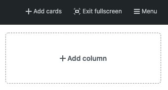

# GitHub Project Scripts

This repository contains scripts that customizes the GitHub projects user experience.

## Hide the "Add column" button

This [script](./scripts/hide-add-column.js) hides the "Add column" button on the GitHub project board.

## Hide columns

This [script](./scripts/hide-columns.js) hides columns on the GitHub project board by their indexes.

- Modify the `COLUMN_INDEXES` list in the script to control which columns to hide.

- The first column starts at index `0`.

## Smaller "Add column" button

This [script](./scripts/smaller-add-column-button.js) makes the "Add column" button on the GitHub project board to be smaller.

